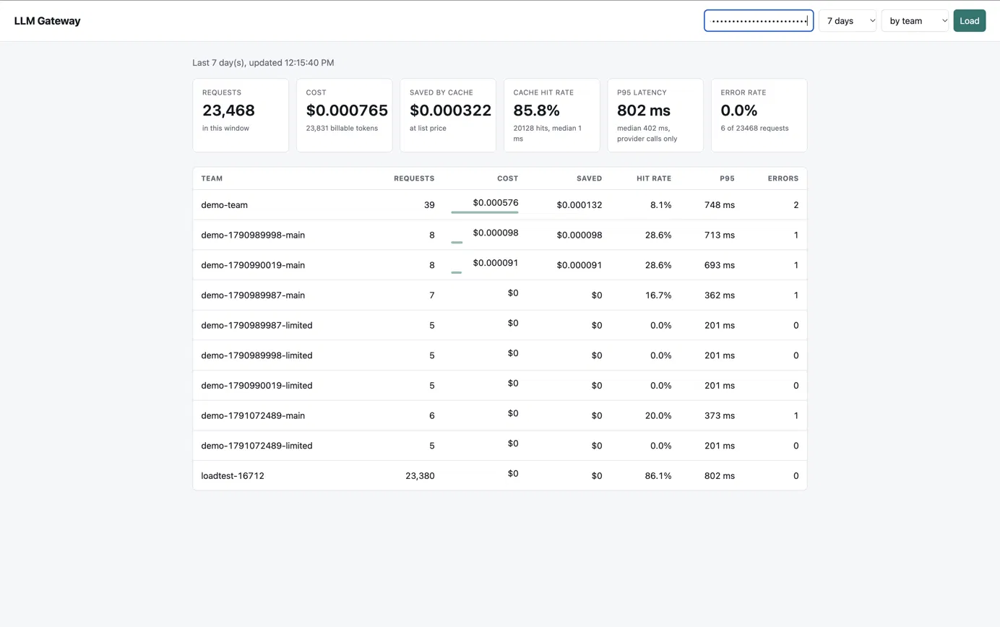
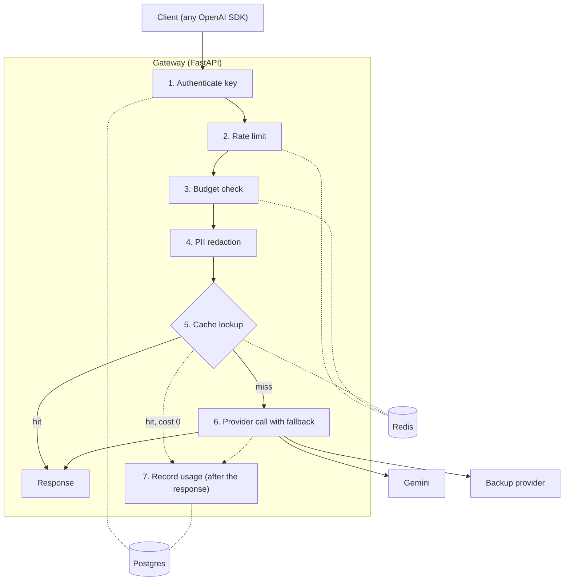

# LLM Gateway

An OpenAI-compatible gateway that sits between your applications and LLM providers. It authenticates teams, enforces rate limits and monthly budgets, masks PII, caches repeated requests, fails over between providers, and reports cost and latency per team.

Existing apps and SDKs use it by changing one line: the `base_url`.



## Why a gateway

When several teams call LLM providers directly, nobody sees the whole picture:

- **Cost blindness.** One bill, and no idea which team or feature caused it.
- **Wasted spend.** The same question is paid for every time it is asked.
- **Outages.** A provider incident takes down every AI feature at once.
- **Data leaks.** Customer emails and card numbers end up in prompts sent to a third party.
- **Key sprawl.** Provider keys get copied into repos and chats, and are hard to revoke.

A single gateway in front of the providers addresses each of these in one place. Projects such as LiteLLM, Portkey, and Helicone solve the same problem. This repository is a focused implementation, built to understand the engineering decisions involved.

## Features

| Feature | How it works |
| --- | --- |
| OpenAI-compatible API | `POST /v1/chat/completions`. The official OpenAI SDK works unchanged, and errors use OpenAI's JSON shape, so SDKs raise their normal exceptions. |
| Per-team API keys | Keys are random 256-bit values and only a SHA-256 hash is stored. Revoking a key takes effect on the next request. |
| Rate limiting | Per-key sliding window in Redis, implemented as one atomic Lua script so it holds under concurrent load. Returns `429` with `Retry-After`. |
| Monthly budgets | A Redis counter in integer micro-dollars, rebuilt from Postgres if it is lost. Over-budget teams get `429`. |
| PII redaction | Emails, phone numbers, SSNs, and Luhn-valid card numbers are masked before the prompt reaches the cache or a provider. |
| Response cache | Exact-match, per team, only for requests with `temperature: 0`. Cache hits cost $0. |
| Provider fallback | Each model maps to an ordered chain of providers. Transient failures (timeouts, 429, 5xx) move on to the next one. |
| Usage and cost | One Postgres row per request: tokens, cost, latency, cache hit. Prompts and responses are never stored. |
| Admin API and dashboard | Create teams and keys, change limits, and view cost, cache hit rate, and p95 latency by team, model, provider, or day. |

## Request pipeline



The order is deliberate. Cheap checks run first, so a rejected request never costs a provider call. Redaction runs before the cache, so raw PII never appears in a cache key or in Redis.

## Quick start

Requirements: Python 3.12+ and Docker.

```bash
git clone https://github.com/KhushaliSamderiya/llm_gateway.git
cd llm_gateway
python3 -m venv .venv && source .venv/bin/activate
pip install -r requirements.txt
cp .env.example .env
```

Edit `.env`:

- `ADMIN_API_KEY`: set a long random value, for example the output of `python3 -c "import secrets; print('adm_' + secrets.token_urlsafe(32))"`. Leave it empty to disable the admin API.
- `GEMINI_API_KEY`: a Google AI Studio key. Any placeholder works if you only use the `mock` model.

Start the databases, create the tables, and run the server:

```bash
docker compose up -d
alembic upgrade head
uvicorn app.main:app --port 8000
```

In a second terminal, create a team and an API key. The key is shown once:

```bash
python -m scripts.create_key --team demo --label quickstart
```

Then call the gateway:

```bash
curl http://localhost:8000/v1/chat/completions \
  -H "Authorization: Bearer gw_YOUR_KEY" \
  -H "Content-Type: application/json" \
  -d '{"model":"mock","messages":[{"role":"user","content":"hello"}]}'
```

`python -m scripts.demo` runs a guided tour of every feature with PASS/FAIL checks. The dashboard is at <http://localhost:8000/dashboard>: paste your admin key into the page.

## Using it

```python
from openai import OpenAI

client = OpenAI(base_url="http://localhost:8000/v1", api_key="gw_YOUR_KEY")
reply = client.chat.completions.create(
    model="gemini-3.5-flash-lite",
    messages=[{"role": "user", "content": "Explain DNS in one sentence."}],
    temperature=0,  # an explicit 0 makes the request cacheable
)
print(reply.choices[0].message.content)
```

Response headers describe what the gateway did:

| Header | Meaning |
| --- | --- |
| `X-Gateway-Cache` | `HIT`, `MISS`, or `BYPASS` (the request was not cacheable) |
| `X-Gateway-PII-Redacted` | What was masked, as counts, for example `EMAIL=1,CARD_NUMBER=1` |
| `X-Gateway-Provider` | Which provider answered |
| `X-Gateway-Fallback-From` | Providers that failed before this one answered |
| `Retry-After` | On a `429`, the seconds until the request could succeed |

Models:

| Model | What it is |
| --- | --- |
| `gemini-3.5-flash-lite` | A real model, through the Gemini API |
| `mock` | A deterministic fake provider with a configurable delay |
| `mock-down` | Its primary provider always fails and the request falls back to `mock` (a failover rehearsal) |
| `mock-dead` | Every provider fails, so the gateway returns a clean `502` |

### Admin API

All admin routes need `Authorization: Bearer <ADMIN_API_KEY>`.

| Request | Purpose |
| --- | --- |
| `POST /admin/v1/teams` | Create a team (`name`, `monthly_budget_usd`) |
| `GET /admin/v1/teams` | List teams |
| `PATCH /admin/v1/teams/{id}` | Change a team's monthly budget |
| `POST /admin/v1/teams/{id}/keys` | Create a key. The raw key is shown once |
| `GET /admin/v1/teams/{id}/keys` | List a team's keys (never shows secrets) |
| `PATCH /admin/v1/keys/{id}` | Change a rate limit, or revoke or reactivate a key |
| `GET /admin/v1/usage?days=7&group_by=team` | Cost, hit rate, p95 latency, and errors, grouped by `team`, `model`, `provider`, or `day` |

## Benchmarks

Setup: a MacBook Air (Apple silicon) running everything on one machine: the Locust load generator, 4 uvicorn workers, and Postgres 16 and Redis 7 in Docker. 50 concurrent users, 30 seconds per run, closed loop (each user sends its next request as soon as the previous one finishes). The provider is a mock with a configurable delay, so runs cost nothing and are repeatable. Raw results are in [`benchmarks/20261004-210340`](benchmarks/20261004-210340), and `bash scripts/benchmark.sh` reproduces the whole set.

### Gateway overhead (instant provider)

| Test | Requests | Throughput | p50 | p95 | p99 | Failures |
| --- | --- | --- | --- | --- | --- | --- |
| 1 user, uncached | 4,190 | 426 req/s | 2.1 ms | 2.4 ms | 3.7 ms | 0 |
| 50 users, uncached | 27,496 | 920 req/s | 43 ms | 92 ms | 130 ms | 0 |
| 50 users, cached | 24,753 | 828 req/s | 50 ms | 105 ms | 160 ms | 0 |

- The single-user run is the real **service time: about 2 ms** per request for the auth query, rate limiter, budget check, and PII redaction.
- At 50 users, everything shares one laptop, so latency measures queueing and throughput is a lower bound.
- The cached run is slightly slower than the uncached one because an instant provider is cheaper than a Redis lookup. The cache pays off when the provider is slow or expensive.
- 9 of the 24,753 cached requests were misses: they arrived at the same instant, before the first answer was stored (see Known limitations).

### With a realistic provider (800 ms)

| Test | Throughput | Cache hits | Latency |
| --- | --- | --- | --- |
| 50 users, uncached | 59.3 req/s | none | p50 816 ms, p95 867 ms, p99 920 ms |
| 50 users, 40% repeated prompts | 96.8 req/s (1.63x) | 39.3% of requests | hits: p50 9.1 ms, p95 47 ms, p99 119 ms. Misses: p50 812 ms, p95 862 ms, p99 947 ms |

- Uncached throughput is close to the theoretical ceiling of about 61 req/s (50 users divided by the 823 ms average response), so the gateway adds almost no queueing of its own.
- A cache hit is about **89x faster** than a miss at the median. In one manual check against the real Gemini API, a miss took about 0.82 s and the repeat about 0.02 s.

## A performance bug the load test found

My first run with an 800 ms provider reached **11.6 req/s** when the ceiling was about 61. Latency percentiles looked healthy (p50 825 ms) and Locust reported zero failures. Three things exposed the problem:

- The throughput did not match 50 users divided by the response time.
- The server log was full of `QueuePool limit of size 5 overflow 10 reached`, raised from the auth dependency and from usage logging.
- Sampling `pg_stat_activity` showed **35 connections `idle in transaction`**.

**Root cause:** the auth dependency opened a database session and kept it until the whole request finished, including the slow provider call. Each worker's pool allows 15 connections, so any request beyond that queued for a connection. Usage rows were being silently dropped as well. Locust hid it because it only reports requests that finish, and the stuck ones were discarded when the run ended.

**Fix:** auth now uses a short-lived session, so its connection returns to the pool right after the key lookup. Pool exhaustion now fails in 5 seconds instead of hanging for 30. A regression test asserts that no connection is checked out while the provider call runs (it failed before the fix). The same test after the fix reached **59.3 req/s** with 2 `idle in transaction` connections in a mid-run snapshot.

The before run did not use `--stop-timeout`, which makes Locust wait for in-flight requests. The gap is far larger than that difference could explain, and the benchmark script now always sets it.

What I took from it:

- Check throughput against users divided by average response time, and look at the database, not only at latency percentiles.
- Never hold a database connection across a call to a slow upstream service.
- Make resource exhaustion fail fast.
- Pin a concurrency bug with a test that asserts its cause.

## Design decisions and trade-offs

| Decision | Why | Trade-off |
| --- | --- | --- |
| OpenAI-compatible API | A drop-in for existing SDKs and apps | Tied to OpenAI's format, and provider-specific features do not fit through it |
| One adapter per provider, and errors carry a `retryable` flag | Fallback logic is a single `if`, and each provider receives its own model name | Only the common features of all providers are exposed |
| SHA-256 for API keys, not bcrypt | Keys are 256-bit random values that cannot be guessed, and a lookup by hash needs a fast, unsalted hash | Only safe for high-entropy secrets, never for passwords |
| Sliding-window rate limiter in a Lua script | Check-and-increment is atomic, there is no burst at window edges, and Redis supplies the clock | Up to `rpm` entries per key, and it fails open if Redis is down |
| Spend counter in Redis, with Postgres as the source of truth | One fast read per request instead of a monthly `SUM` | A soft limit: cost is known after the call, so in-flight requests can overshoot |
| Cache only an explicit `temperature: 0`, keyed per team on the redacted prompt | An unset temperature means the provider default (usually above 0). Per-team keys stop cross-tenant leakage through response timing, and hashing redacted text keeps PII out of keys | Lower hit rate, and a stampede on simultaneous identical requests |
| Backup providers' answers are not cached | A weaker model's answer should not be served for an hour after the primary recovers | Fewer hits during an outage |
| No prompts or responses in Postgres | A database leak exposes usage metadata, not conversations | A bad answer cannot be debugged afterwards (cached responses live in Redis for 1 hour) |
| Provider-reported token counts times a price table, with money as `Decimal` | Exact and auditable | Prices are hardcoded in `app/pricing.py` and go stale |
| Background usage logging, with failed calls logged synchronously | Callers never wait on the database, and FastAPI drops background tasks when an endpoint raises | A crash at the wrong moment can lose a row |
| Fail open on Redis errors | A Redis outage should not take down every AI feature | Limits and budgets stop being enforced during an outage |
| Mock providers, including an always-failing one | Free, deterministic load tests and outage rehearsals | Mock results do not prove real-provider behaviour |

## Known limitations

- **One real provider.** Failover is demonstrated with mock providers. Adding a real second provider is one adapter plus one line in the registry.
- **No streaming.** `stream: true` returns a clear `400`.
- **PII detection is regex-based.** Names and addresses are not detected, only prompts are redacted (not responses), and long digit strings can be masked by mistake.
- **Budgets are soft limits.** See the trade-off above. A hard limit would need to reserve an estimated cost up front.
- **No circuit breaker.** A provider that hangs costs a full timeout on every request until it recovers.
- **Cache stampede.** Simultaneous identical requests all miss. The cache hit rate also counts uncacheable requests in its denominator, so it understates the rate for cacheable traffic.
- **Auth queries Postgres on every request.** Caching key lookups in Redis would fix it, at the cost of delayed revocation.
- **Blocked traffic is not logged.** Only requests that reach a provider are recorded, so `401` and `429` responses do not appear in the dashboard. Success rows record the model that answered, not the name the client asked for.
- **Admin access is one shared key,** with no audit log and no pagination.
- **Benchmarks are relative.** They were measured on a laptop with every component on the same machine.

## Project layout

```
app/
  main.py            app setup and OpenAI-style error handlers
  chat.py            the endpoint: orchestrates the pipeline
  auth.py            API key lookup
  ratelimit.py       sliding-window limiter (Redis + Lua)
  budget.py          monthly spend counter
  pii.py             redaction
  cache.py           exact-match response cache
  fallback.py        provider chains
  providers/         Gemini and mock adapters, plus the registry
  usage.py, usage_stats.py, usage_api.py, pricing.py   cost and usage reporting
  admin.py, dashboard.py, static/                      admin API and dashboard
  models.py, db.py, config.py, schemas.py, errors.py, security.py
migrations/          Alembic migrations
tests/               83 tests: unit tests plus integration tests against real Postgres and Redis
scripts/             create_key, demo, benchmark, load test, SDK test
benchmarks/          saved benchmark results
```

## Development

```bash
pip install -r requirements-dev.txt
docker compose up -d
docker compose exec postgres psql -U gateway -d gateway -c "CREATE DATABASE gateway_test;"
python -m pytest -q
```

The tests use their own database (`gateway_test`) and Redis database 1, so they never touch your development data. Load tests use the mock provider only: run `bash scripts/benchmark.sh` with the virtualenv active and nothing listening on port 8000.
